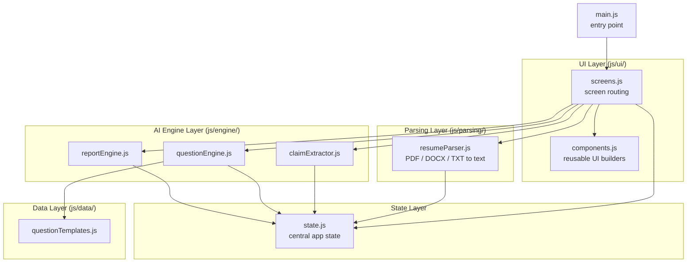
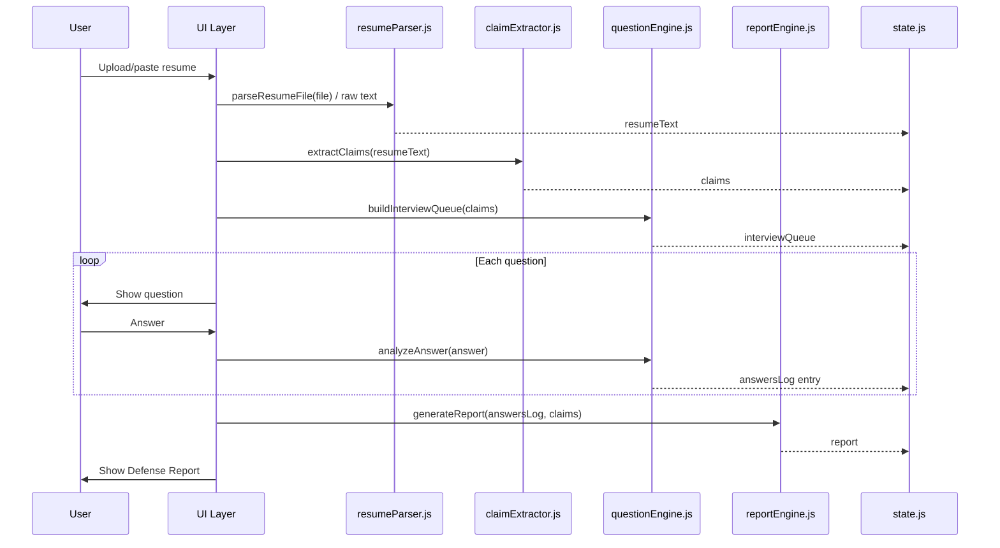
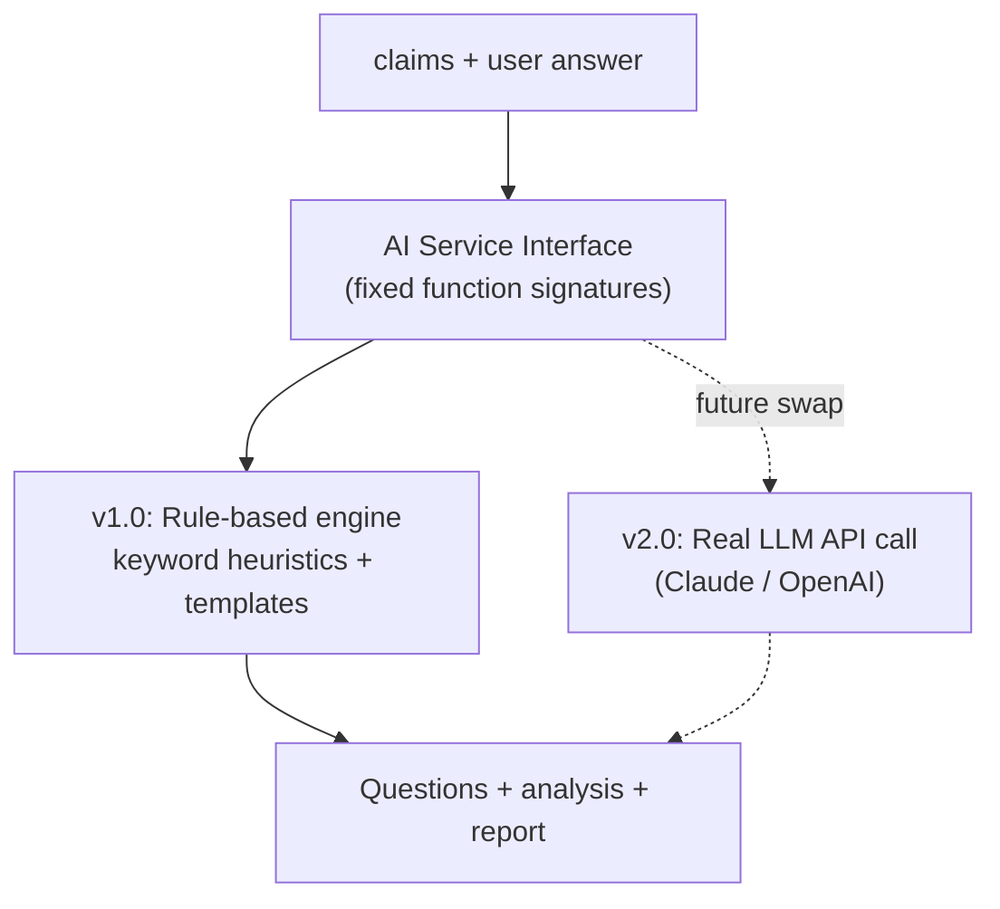
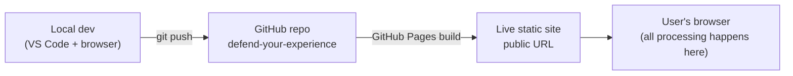

# System Architecture — Defend Your Experience

This document defines the complete technical architecture for v1.0. It is the source of truth for how components fit together. No production code is written from this document directly — it guides implementation on Days 4–7.

---

## 1. Architecture Principles (locked in from PRD)

- Pure client-side single-page application. No backend server.
- No database — all state lives in memory for the session (`state.js`).
- No authentication — no accounts in v1.0.
- The "AI" layer (claim extraction + question generation) is rule-based JavaScript, isolated behind clean function interfaces so it can be replaced by a real LLM API call in v2.0 without touching the UI layer.
- Static deployment — GitHub Pages / Netlify / Vercel.

---

## 2. Component Diagram



**Responsibilities:**
- `main.js` — bootstraps the app, mounts the initial screen
- `state.js` — single source of truth for session data (resume text, claims, interview queue, answers, report)
- `ui/` — renders whatever is in `state.js`; contains no business logic
- `parsing/` — converts uploaded files into plain text
- `engine/` — the three swappable "intelligence" modules
- `data/` — static question template library consumed by `questionEngine.js`

---

## 3. Data Flow

```mermaid
flowchart LR
    A["Resume file / pasted text"] --> B["resumeParser.js"]
    B --> C["state.resumeText"]
    C --> D["claimExtractor.js"]
    D --> E["state.claims"]
    E --> F["questionEngine.js"]
    F --> G["state.interviewQueue"]
    G --> H["Chat UI<br/>(user answers)"]
    H --> I["state.answersLog"]
    I --> J["reportEngine.js"]
    J --> K["state.report"]
    K --> L["Report screen"]
```



Data flows strictly in one direction through the pipeline above — each stage reads only from `state.js` and writes back to `state.js`. No stage calls another stage's internals directly; this keeps every module independently replaceable.

---

## 4. Request Lifecycle (single user session, v1.0)



Since there is no server, every "request" in this lifecycle is a synchronous or promise-based in-browser function call — there is no network round trip except the one-time load of pdf.js/mammoth.js from CDN.

---

## 5. AI Interaction (v1.0 rule-based, v2.0-ready)



**Why this matters:** `claimExtractor.js`, `questionEngine.js`, and `reportEngine.js` each expose one clean exported function (`extractClaims()`, `buildInterviewQueue()` / `analyzeAnswer()`, `generateReport()`). The UI only ever calls these three functions and never inspects their internals. In v2.0, each function's *implementation* can be replaced with a `fetch()` call to a real LLM API — the function signature and what it returns stays identical, so no UI code changes.

---

## 6. External Services

| Service | Purpose | Cost | Notes |
|---|---|---|---|
| **pdf.js** (CDN) | Parse PDF resumes into text | Free | Loaded via `<script>` tag, no API key |
| **mammoth.js** (CDN) | Parse DOCX resumes into text | Free | Loaded via `<script>` tag, no API key |
| **GitHub Pages** | Static hosting | Free | Deploys directly from the repo |

No other external services are used in v1.0. There is no analytics, no error-tracking service, and no API backend — consistent with the zero-infrastructure, privacy-first design goal in the PRD.

---

## 7. State Shape (reference — not implementation)

```
state = {
  currentScreen: "landing" | "input" | "processing" | "interview" | "report",
  resumeText: string,
  linkedinContext: string,
  claims: {
    technicalSkills: [string],
    projects: [string],
    education: [string],
    behavioral: [string]
  },
  interviewQueue: [ { id, category, claim, questionText } ],
  currentQuestionIndex: number,
  answersLog: [ { question, answer, analysis: "vague"|"adequate"|"strong" } ],
  report: {
    score: number,
    strengths: [string],
    weaknesses: [string],
    feedback: string,
    suggestions: [string],
    practiceQuestions: [string]
  }
}
```

This shape is referenced by SCHEMA.md (which documents it as the closest thing this project has to a "database schema," since there is no real database).

---

## 8. Deployment Architecture



No CI/CD pipeline is needed beyond GitHub Pages' built-in static publishing — there is no build step, no compilation, no server to provision.
