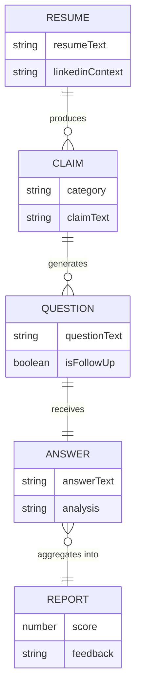

# Data Schema — Defend Your Experience

## Important note on scope

This project has **no database** — a deliberate v1.0 decision confirmed in the PRD (Section 9, Architecture Principles) to keep the app fully client-side, private, and free to host. There are no tables, no persistence, and no server-side storage.

What this document provides instead is the **in-memory state schema**: the single JavaScript object (`state.js`) that acts as the app's data model for the duration of a session. This is the closest equivalent to a database schema this project has, and it is validated against every relevant user story below.

---

## 1. State Schema

```javascript
{
  // Navigation
  currentScreen: "landing" | "input" | "processing" | "interview" | "report",

  // Raw input (from Day 4)
  resumeText: "",           // string — parsed plain text from PDF/DOCX/TXT/paste
  linkedinContext: "",      // string — optional LinkedIn About / project text

  // Extracted claims (from Day 5)
  claims: {
    technicalSkills: [],    // array of strings
    projects: [],           // array of strings
    education: [],          // array of strings
    behavioral: []          // array of strings
  },

  // Interview session (from Day 6)
  interviewQueue: [
    {
      id: "",              // string, unique per question
      category: "",        // "technicalSkills" | "projects" | "education" | "behavioral"
      claimText: "",        // the specific claim this question targets
      questionText: "",     // the filled question template
      isFollowUp: false     // boolean — true if this is a probe question
    }
  ],
  currentQuestionIndex: 0,  // number

  answersLog: [
    {
      questionId: "",
      questionText: "",
      answerText: "",
      analysis: "vague" | "adequate" | "strong"
    }
  ],

  // Final output (from Day 7)
  report: {
    score: 0,                  // number, 0-100
    strengths: [],              // array of claim strings
    weaknesses: [],             // array of claim strings
    feedback: "",                // string, templated qualitative paragraph
    suggestions: [],             // array of strings
    practiceQuestions: []        // array of strings
  }
}
```

---

## 2. Field Constraints

| Field | Constraint |
|---|---|
| `resumeText` | Minimum 100 characters (validated on Day 4) before proceeding to processing |
| `claims.*` | Each category array may be empty (some resumes lack a category), but at least one category combined must be non-empty or the user is prompted to try pasting instead |
| `interviewQueue` | Capped at 6–8 questions total (per Day 6 blueprint) to respect the time-boxed interview experience |
| `answersLog[].analysis` | Must be exactly one of `"vague"`, `"adequate"`, `"strong"` — enforced by `analyzeAnswer()`'s return type |
| `report.score` | Integer 0–100 inclusive |

---

## 3. Relationships (conceptual, not relational-DB relationships)



This is a **conceptual** relationship diagram to clarify how data derives from data — it does not imply a relational database exists. All of this lives in one in-memory JS object per session.

---

## 4. Schema Validation Against PRD User Stories / Functional Requirements

| Requirement (PRD Section 7) | Schema field(s) that satisfy it |
|---|---|
| FR-1/FR-2: user can upload or paste a resume | `resumeText` |
| FR-3: system extracts and categorizes claims | `claims.technicalSkills`, `claims.projects`, `claims.education`, `claims.behavioral` |
| FR-4: system generates a personalized question sequence | `interviewQueue` |
| FR-5: adaptive follow-up questions | `interviewQueue[].isFollowUp`, driven by `answersLog[].analysis` |
| FR-6: Defense Report with score + feedback | `report.score`, `report.feedback`, `report.strengths`, `report.weaknesses`, `report.suggestions` |
| FR-7: user can view categorized claims before interview | `claims` object, rendered directly by the claims summary screen |
| FR-8: user can download/export the report | `report` object serialized to a downloadable file (no new field needed — export is a UI-layer transformation of existing data) |
| FR-9: optional LinkedIn/project context | `linkedinContext` |
| FR-10: architecture supports swapping in a real LLM later | Schema is engine-agnostic — every field is populated by a function call, not by a specific engine implementation, so a v2.0 LLM-based engine would populate the exact same shape |

**Result: every functional requirement in the PRD maps cleanly to a field in this schema. No gaps found, no unnecessary fields present.**

---

## 5. Why No Real Database

- v1.0 has no accounts and no persistence across sessions (explicitly out of scope per PRD Section 5.2) — so there is nothing that needs to survive a page refresh or be shared between users.
- Local-only in-memory state is the simplest architecture that satisfies every FR above, and it directly delivers the "resume never leaves your device" privacy promise from the PRD.
- v2.0 (if accounts/history are added) would introduce a real schema at that point — likely IndexedDB for local persistence first, before considering a server-side database. That decision is deferred, not designed now, to avoid scope creep.
