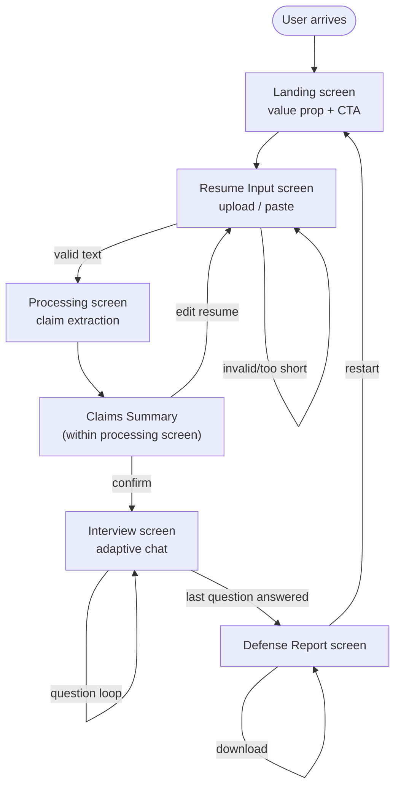

# UI & User Flow — Defend Your Experience

## 1. User Flow Diagram



Every screen exists to serve exactly one step of the core flow defined in the PRD (Section 6) — there are no extraneous screens, and no screen exists without a clear purpose tied back to a functional requirement.

---

## 2. Screen Flow (with purpose for each screen)

| # | Screen | Purpose | Exit condition(s) |
|---|---|---|---|
| 1 | **Landing** | Communicate the value proposition, build trust (privacy messaging), single clear CTA | User clicks "Start Your Defense" |
| 2 | **Resume Input** | Collect resume text via upload or paste, optional LinkedIn context | Valid text (≥100 chars) submitted |
| 3 | **Processing / Claims Summary** | Show extraction "thinking," then let user confirm categorized claims before committing to the interview | User clicks "Start Interview" or "Edit Resume" |
| 4 | **Interview (Chat)** | Run the adaptive Q&A session, one question at a time | Last question in queue answered |
| 5 | **Defense Report** | Deliver the payoff: score, strengths, weaknesses, suggestions, practice questions | User downloads report or restarts |

No 6th screen (like a settings or account screen) exists — consistent with the PRD's explicit exclusion of accounts/login for v1.0.

---

## 3. Navigation Model

- **Linear, single-direction flow** for the primary path (Landing → Input → Processing → Interview → Report) — no complex nested navigation, consistent with a single-session, no-account app.
- **One backward path**: Claims Summary → Input (in case the user wants to re-paste/re-upload before committing).
- **One reset path**: Report → Landing (via "Restart"), which clears all session state.
- No global navigation bar/menu is needed — each screen has at most one primary action button and, where relevant, one secondary/back action. This keeps the experience focused and reduces the chance of user error mid-interview.

---

## 4. Low-Fidelity Wireframes

### Screen 1 — Landing

```
┌──────────────────────────────────────────────┐
│  DEFEND YOUR EXPERIENCE                       │
│                                                │
│   Your resume is polished.                    │
│   Can you defend it?                          │
│                                                │
│   [Short 1-2 line value prop text]            │
│                                                │
│   🔒 100% private — your resume never          │
│      leaves your browser                       │
│                                                │
│         [ Start Your Defense → ]              │
│                                                │
└──────────────────────────────────────────────┘
```

### Screen 2 — Resume Input

```
┌──────────────────────────────────────────────┐
│  ← Back            Step 1 of 4                │
│                                                │
│  Upload your resume                           │
│  ┌──────────────────────────────────────┐    │
│  │   [drag & drop PDF/DOCX/TXT]          │    │
│  │        or click to browse             │    │
│  └──────────────────────────────────────┘    │
│                                                │
│  — or paste your resume text —                │
│  ┌──────────────────────────────────────┐    │
│  │ [textarea]                            │    │
│  └──────────────────────────────────────┘    │
│                                                │
│  ▸ Optional: paste LinkedIn About / projects  │
│  ┌──────────────────────────────────────┐    │
│  │ [textarea, collapsed by default]      │    │
│  └──────────────────────────────────────┘    │
│                                                │
│              [ Continue → ]                   │
└──────────────────────────────────────────────┘
```

### Screen 3 — Processing / Claims Summary

```
┌──────────────────────────────────────────────┐
│                Step 2 of 4                     │
│                                                │
│   Analyzing your resume...                    │
│   ✓ Extracting projects                       │
│   ✓ Extracting technical skills                │
│   ✓ Categorizing achievements                  │
│                                                │
│   ── once complete ──                          │
│                                                │
│   Here's what we found:                        │
│   PROJECTS        [chip] [chip] [chip]         │
│   SKILLS          [chip] [chip] [chip] [chip]  │
│   EDUCATION       [chip]                        │
│   LEADERSHIP      [chip]                        │
│                                                │
│   [ Edit Resume ]      [ Start Interview → ]   │
└──────────────────────────────────────────────┘
```

### Screen 4 — Interview (Chat)

```
┌──────────────────────────────────────────────┐
│                Step 3 of 4    Question 3 of 7  │
│  ▓▓▓▓▓▓░░░░░░░░░░░░░░░░  (progress bar)        │
│                                                │
│  🤖  Tell me about NutriScope. What was your   │
│      specific role in building it?             │
│                                                │
│                        You: I built the entire │
│                        front-end and the data   │
│                        visualization layer.  🧑 │
│                                                │
│  🤖  What was the hardest technical decision    │
│      in that project?                          │
│                                                │
│  ┌──────────────────────────────────────┐    │
│  │ [type your answer...]           [Send]│    │
│  └──────────────────────────────────────┘    │
└──────────────────────────────────────────────┘
```

### Screen 5 — Defense Report

```
┌──────────────────────────────────────────────┐
│                Step 4 of 4                     │
│                                                │
│              ╭─────────╮                       │
│              │   78%   │  Confidence Score      │
│              ╰─────────╯                       │
│                                                │
│  💪 Strongest claims                           │
│   • NutriScope — clear, specific, quantified   │
│   • Leadership role in ABTalks series           │
│                                                │
│  ⚠ Needs work                                  │
│   • "Familiar with Python" — no concrete example│
│                                                │
│  📝 Suggestions                                │
│   • Add a measurable outcome to the Python bullet│
│                                                │
│  🎯 Practice questions for next time            │
│   • "Walk me through a bug you couldn't fix"    │
│                                                │
│  [ Download Report ]      [ Restart ]          │
└──────────────────────────────────────────────┘
```

---

## 5. Design System Reference (from Day 1 pitch deck / prior portfolio style)

- **Theme:** Dark, glassmorphism cards, navy/charcoal background
- **Accent:** One consistent accent color (amber or neon purple, finalized on Day 3)
- **Typography:** Clear hierarchy — large serif/display headline on landing, clean sans-serif body throughout
- **Components to design on Day 3:** buttons (primary/secondary), glass cards, progress bar, chat bubbles (system vs. user), category chips/tags, score ring/gauge

This wireframe set is intentionally low-fidelity — Day 3 of the Implementation Blueprint is where these become fully styled, polished screens using the design system above.
